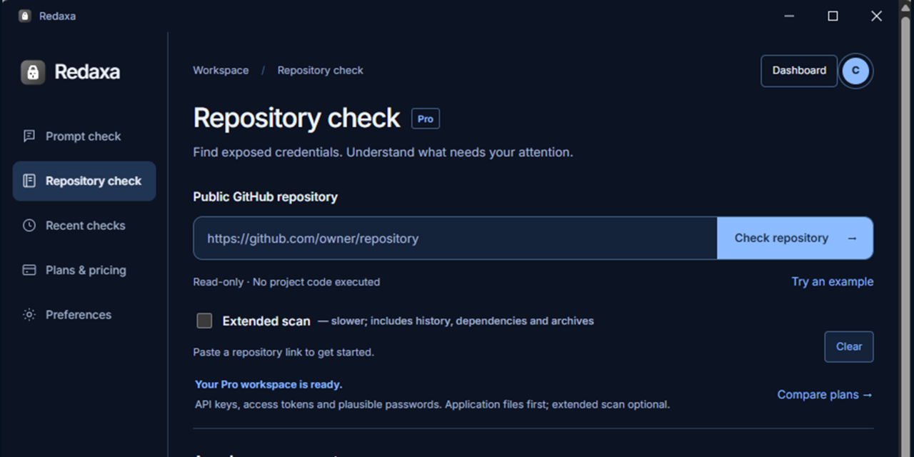

<p align="center">
  
</p>

<h1 align="center">Redaxa — Sensitive Data Checks for AI Prompts and Repositories</h1>

<p align="center">
  <strong>Catch what you're about to leak, before it reaches an AI tool.</strong><br>
  Emails, secrets, cards, IBANs, private keys — flagged and redactable before you paste into ChatGPT, Claude, Gemini, Copilot or Perplexity. Scanned on our backend, not sent to any AI provider — details in <a href="#privacy">Privacy</a> below.
</p>

<p align="center">
  <a href="https://promptshield-beta.vercel.app"></a>
  <a href="LICENSE"></a>
  <a href="../../releases"></a>
  <a href="https://github.com/microsoft/winget-pkgs/tree/master/manifests/a/AurelioAvila/Redaxa"></a>
</p>

<p align="center"><sub>Want safer AI workflows? ⭐ Star Redaxa to follow new protections and help others find it.</sub></p>

<p align="center"><sub><strong>Redaxa was previously known as PromptShield.</strong> The web app still uses the promptshield-beta.vercel.app address; existing links and releases remain valid.</sub></p>

**Fastest way to try it — [web app](https://promptshield-beta.vercel.app), nothing to install** ·
[⬇ Latest Windows desktop app](../../releases/latest) ·
[Changelog](CHANGELOG.md) · [Privacy Policy](https://promptshield-beta.vercel.app/privacy.html) ·
[Terms](https://promptshield-beta.vercel.app/terms.html)

The [v0.4.4 Windows setup EXE](../../releases/tag/v0.4.4) was checked on September 26, 2026. Its SHA-256 is `3696db5f07add74a2e6c01586aeb2d90bff3b86fb84e784708863a2946bc739c`; its Authenticode signature identifies **Aurelio Avila** and includes a trusted timestamp. Its Tauri updater signature was also verified against the released installer. See the [Windows signing inventory and verification guide](https://github.com/AurelioAvila/.github/blob/master/CODE_SIGNING.md) to verify a downloaded file. This evidence applies to that specific setup EXE, not every release asset, future build, the web app or browser extension. Use [latest release](../../releases/latest) for current downloads and release notes; changes on the default branch may not yet be included in an installer.

**WinGet status (September 26, 2026):** version 0.4.2 is available in the [official catalog](https://github.com/microsoft/winget-pkgs/tree/master/manifests/a/AurelioAvila/Redaxa). The [0.4.4 update](https://github.com/microsoft/winget-pkgs/pull/441593) has been submitted; the older 0.4.3 submission was closed as superseded. Until 0.4.4 is merged and indexed, install the latest signed version from [GitHub Releases](../../releases/latest).

> The browser extension (source in [`browser-extension/`](browser-extension))
> is available on the [Chrome Web Store](https://chromewebstore.google.com/detail/redaxa/clkobbjoaegkgnmkibjghlboeoplpmok). Extension source **0.4.3** adds manual text checks without an account (5 per 24 hours, shared by network), redacted output and copying inside the popup. Automatic checks require an active trial or subscription; Windows repository checks require Pro or Business. This source update is prepared locally and is not yet the store version. Desktop and extension versions are independent.

---

## Why

You're about to paste a stack trace, a config file, or a client email into
ChatGPT. Somewhere in there is an API key, a card number, or someone's
email address you didn't mean to send. Redaxa helps you review it before you
hit enter, using patterns and category-specific checks: Luhn for card-number
candidates, mod-97 for IBANs and reserved-range filtering for SSNs. These
checks reduce some false positives; they do not prove that a match is
genuine or that every sensitive value will be found.

---

## What it does

Paste a prompt in. Redaxa highlights potential sensitive values and offers
a redacted version for you to review before sending.

| Category | Detected |
| --- | --- |
| **Personal data** | Email addresses, phone numbers, IPv4 addresses, names right after a greeting ("Dear John Smith,"), street addresses |
| **Credentials** | API keys and tokens (OpenAI, Stripe, AWS, Google, GitHub, Slack), JWTs, private key blocks, passwords/secrets after `key: value` |
| **Financial data** | Card numbers (Luhn-checksum validated), IBANs (mod-97 checksum validated), crypto wallet addresses, Italian fiscal codes, US SSNs (reserved-range filtered) |
| **Custom terms** | Your own project codenames, client names, anything you want flagged that isn't generic PII |

Detection combines patterns, known credential prefixes and category-specific
checks. A tracking number can still pass a card checksum, and an unfamiliar
secret can be missed. Review matches in context and use custom terms for
sensitive values outside the built-in rules.

### Review a GitHub repository on Windows

Pro and Business users can check a public GitHub repository for possible exposed credentials in the Windows app. The focused check reads current files; an optional extended check includes accessible Git history, dependencies and supported archives. Redaxa prioritizes likely API keys and tokens, shows coverage and exclusions, and exports a redacted report. The repository check runs locally, unlike prompt scanning through Redaxa's backend. Findings need human review: Redaxa does not test whether a key works, revoke it, or perform a complete code vulnerability audit. [See the repository workflow](https://promptshield-beta.vercel.app/#repository) and [v0.4.1 release notes](RELEASE-NOTES-0.4.1.md).

## For teams: the control layer

On the Business plan, a workspace is a real organization:

- **Policies** — per category (credentials, financial, personal, protected
  terms) an admin chooses *warn*, *redact* or *block*. Block removes "Send
  anyway" in the browser extension: the prompt does not leave until fixed.
- **Shared protected terms** — protect a project codename or client name
  once and every member's checks flag it, on every device and surface.
- **Explainable decisions** — every scan names the rule that decided and
  why, on every surface.
- **Audit trail, metadata only** — every check leaves an event (surface,
  detection kinds, decision). Never the prompt, never a value: the events
  table has no column that could hold content. Members see their own
  activity; owners and admins see the organization's.

## Where it runs

- **Web app** — [promptshield-beta.vercel.app](https://promptshield-beta.vercel.app), no install
- **Windows desktop app** — this repo's installer, signs in once and stays signed in (session held in the OS credential store, not a file on disk)
- **[Browser extension](https://chromewebstore.google.com/detail/redaxa/clkobbjoaegkgnmkibjghlboeoplpmok)** — a "Check" button injected into ChatGPT, Claude, Gemini, Copilot and Perplexity that scans whatever's in the composer before you send it

## Privacy

**Your prompt text is sent to Redaxa's own backend to be scanned — it
is not processed entirely on-device.** That's a deliberate tradeoff, not a
hidden detail: running the same detection logic server-side is what lets
the web app, desktop app and browser extension all give identical results.
What that scan does *not* do: your text is never sent to a third-party AI
or classification service as part of scanning (`api/scan.ts` is regex/Luhn/
mod-97 logic, no outbound calls), and the request body is used only to
compute the response — never logged, stored, or forwarded anywhere; see
[`api/scan.ts`](api/scan.ts) and the full
[privacy policy](https://promptshield-beta.vercel.app/privacy.html). No
analytics, no ad trackers, no selling data. The desktop app never handles
your password directly for long — auth tokens live in Windows Credential
Manager, not in a plain file.

## Run locally

```bash
npm install
npm test
npm start
```

Open `http://127.0.0.1:4173/dashboard.html`. Account creation and billing
require the Vercel deployment (`api/`) with Supabase and Stripe configured
— see `.env.example`.

To build the Windows desktop app:

```bash
npx tauri build
```

## Product boundaries

Redaxa is a protective review layer, not a guarantee that all
sensitive data will be caught — detection has irreducible false negatives,
and you're always the one who decides what actually gets sent. Team sharing
and cloud sync of scan history are not implemented; history stays in the
browser's local storage only.

Secret/credential detection matches known vendor prefixes (`sk-`, `AIza`,
`AKIA`, `ghp_`/`gho_`, `xox*-`, JWTs, `Bearer` tokens) — a generic
high-entropy API key without a recognizable prefix won't be flagged. If
your workflow involves custom or in-house token formats, add them as a
custom term rather than relying on the built-in credential patterns.

## Architecture notes

- [`scanner.ts`](scanner.ts) — the detection engine shared by every surface
- [`api/scan.ts`](api/scan.ts) — the endpoint the web app, desktop app and browser extension all call
- [`api/auth/*.ts`](api/auth) — thin proxies to Supabase Auth; the web app never handles raw tokens (httpOnly cookies), the desktop app and extension hold a Bearer token pair themselves
- [`api/billing.ts`](api/billing.ts), [`api/stripe-webhook.ts`](api/stripe-webhook.ts) — Stripe subscription lifecycle, backed by `supabase/migrations/` (RLS enabled, no public write policies)
- [`browser-extension/`](browser-extension) — the MV3 Chrome extension source
- [`src-tauri/`](src-tauri) — the Windows desktop app shell (Tauri v2 + Rust)

## License

Proprietary — all rights reserved. Source is visible for transparency; see [LICENSE](LICENSE) for terms. Not open for reuse, modification, or redistribution.
