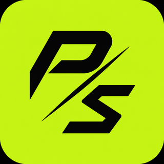

# PromptShield

Privacy-first protection for people and small teams using AI.

PromptShield detects sensitive information before it reaches AI tools, explains the risk, and offers a safe redacted version of the prompt.

> Early private prototype — not ready for production use.

## Product direction

- English is the default interface language.
- Additional translations will target the most important user markets first.
- Detection and redaction should happen locally whenever possible.
- Cloud AI is optional and receives only already-redacted content.
- Every blocked or transformed prompt should be explainable to the user.

## Initial product flow

1. Paste or type a prompt in the PromptShield interface.
2. Detect PII, credentials, secrets, and company-sensitive data.
3. Show exactly what was found and why it matters.
4. Replace sensitive values with safe placeholders.
5. Let the user copy the protected prompt to the selected AI tool.

## Planned architecture

- **Frontend:** desktop-first web interface, English-first with i18n from day one.
- **Backend:** API for accounts, policies, usage and team administration.
- **Detection:** deterministic rules and Microsoft Presidio, with custom recognizers.
- **Optional local model:** small local model for ambiguous context classification.
- **Deployment:** frontend and API on Railway, using a subdomain under `getcertsprint.com`.

The final service boundaries and deployment names will be decided before the first public beta.

## Roadmap

- [ ] Define supported sensitive-data categories
- [ ] Build the local detection and redaction pipeline
- [ ] Create the English UI shell and translation system
- [ ] Add explainable detection results
- [ ] Add a browser extension proof of concept
- [ ] Connect Railway environments
- [ ] Add authentication and a private beta waitlist
- [ ] Evaluate detection quality with a labelled test set

## Privacy principles

PromptShield must never claim to protect data it has not actually inspected. Raw prompts should not be retained by default, and any optional telemetry must be explicit, minimal, and documented.

## Status

Private prototype. The repository is intentionally kept private while the product scope and threat model are being validated.
